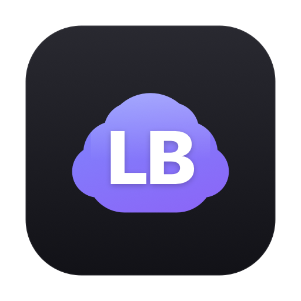
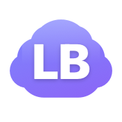
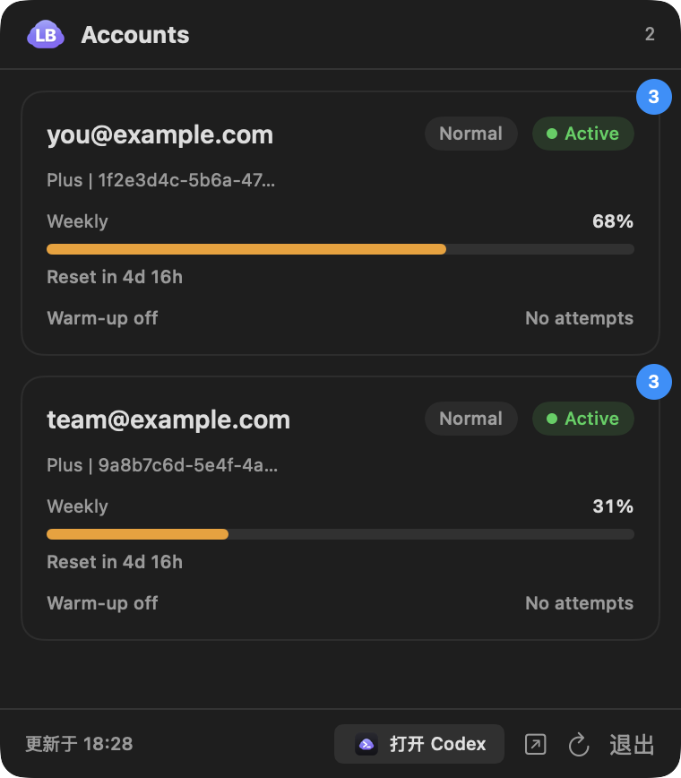
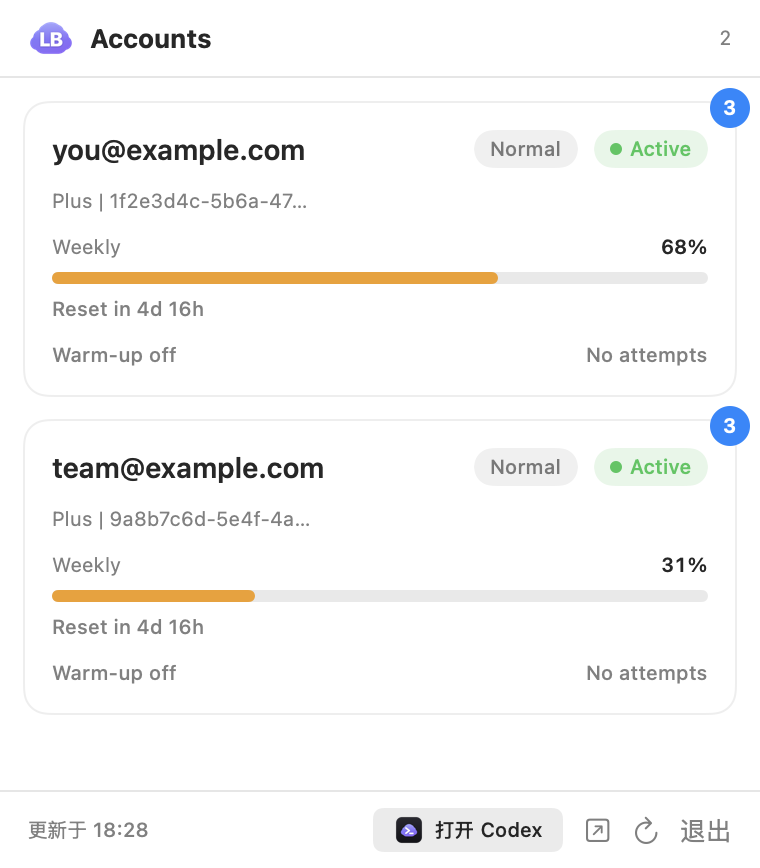

<div align="center">



# CodexBar

**一个轻量的原生 macOS 菜单栏应用，一眼查看你的 [codex-lb](https://github.com/AlexShang1992/codex-lb-menubar) 账号用量。**

[](https://github.com/AlexShang1992/codex-lb-menubar/releases)
[](https://github.com/AlexShang1992/codex-lb-menubar/actions/workflows/ci.yml)
[](LICENSE)
[](https://www.apple.com/macos/)
[](https://swift.org)

[English](README.md) · 简体中文

</div>

---

CodexBar 以一个图标常驻菜单栏。点击即弹出简洁的卡片列表，每个账号一张卡：套餐、路由策略、
状态、周用量、重置倒计时、warm-up 状态、可用 reset credits —— 数据实时来自本地
[`codex-lb`](#codex-lb-是什么) 服务。

纯 Swift 编写（AppKit + SwiftUI），**零第三方依赖**，空闲时 **0% CPU**、**约 27 MB** 内存，
只需 Xcode Command Line Tools 即可编译。

## 功能特性

- 🧭 **原生菜单栏**：单击弹出，不占 Dock、无主窗口。
- 🔄 **打开即刷新**：每次点开都拉取最新数据，不做后台轮询，空闲零开销。
- 🃏 **信息一目了然**：邮箱、`Normal`/`Active` 标签、套餐 + 账号 ID、周用量进度条、
  重置倒计时、warm-up 状态、reset-credits 徽标。
- 🌗 **明暗自适应**：跟随系统外观。
- 🌐 **一键打开面板**：直达 codex-lb 网页控制台。
- 🪶 **极致轻量**：没有 Electron、没有重框架 —— 约 27 MB、空闲 0% CPU。
- 🔧 **可配置地址**：通过环境变量 `CODEXBAR_ENDPOINT` 覆盖。

## 截图

菜单栏里只有一个图标（），点击弹出面板：

|                     暗色                     |                     亮色                      |
| :------------------------------------------: | :-------------------------------------------: |
|  |  |

<sub>由 `make screenshots` 用脱敏假数据从真实界面渲染。</sub>

## 环境要求

- macOS 13 (Ventura) 及以上
- 一个运行中的 [`codex-lb`](#codex-lb-是什么)，默认地址 `http://127.0.0.1:2455`
- 从源码构建需要 Xcode Command Line Tools（`xcode-select --install`），**无需**完整 Xcode。

## 安装

### 方式 A —— 下载 Release

1. 从 [Releases](https://github.com/AlexShang1992/codex-lb-menubar/releases) 下载
   **`CodexBar.dmg`**。
2. 打开后把 **CodexBar** 拖到 **Applications** 即可安装。
3. 由于是 ad-hoc 签名（未公证），首次启动需右键 → **打开**，或执行一次：

   ```sh
   xattr -dr com.apple.quarantine /Applications/CodexBar.app
   ```

> 如果你更喜欢压缩包，Release 里也附了 `CodexBar.app.zip`。

### 方式 B —— 从源码构建

```sh
git clone https://github.com/AlexShang1992/codex-lb-menubar.git
cd codex-lb-menubar
make build      # 生成 ./CodexBar.app
make run        # 构建并启动
```

## 使用

- **打开**：点击菜单栏的云朵 **LB** 图标。
- **刷新**：打开即自动刷新；↻ 按钮可强制刷新。
- **打开面板**：↗ 按钮在浏览器中打开 codex-lb 网页。
- **退出**：底部“退出”按钮。

### 开机自启

在 **系统设置 → 通用 → 登录项** 中添加 `CodexBar.app`。

### 自定义地址

若 codex-lb 跑在别的主机/端口：

```sh
CODEXBAR_ENDPOINT=http://127.0.0.1:9000 open -a CodexBar
```

## codex-lb 是什么？

`codex-lb` 是一个本地的 Codex/ChatGPT 账号负载均衡器，暴露了 `GET /api/accounts` 的 JSON
接口和 `/accounts` 网页控制台。CodexBar 只是它的**只读查看器**——不修改账号、不代理任何流量。

## 工作原理

```
┌───────────────┐     GET /api/accounts      ┌──────────────────┐
│   CodexBar    │ ─────────────────────────► │     codex-lb     │
│  (菜单栏应用)  │ ◄───────────────────────── │  127.0.0.1:2455  │
└───────────────┘        accounts JSON       └──────────────────┘
```

- `NSStatusItem` 渲染菜单栏图标，点击切换 `NSPopover`。
- 打开时 `AccountsViewModel` 异步 `URLSession` 拉取并解码为 `Account` 模型。
- 弹窗高度按账号数量动态计算，既不会被菜单栏遮挡也不留空白。

## 开发

```sh
make build      # 编译 + 组装 .app（swiftc，ad-hoc 签名）
make icons      # 由 Tools/MakeIcon.swift 重新生成图标
make selftest   # 无界面拉取 + 解码自检
make run        # 构建并启动
make clean      # 清理构建产物
make help       # 查看全部命令
```

### 目录结构

```
Sources/
  main.swift              入口（含 --selftest 无界面自检）
  AppDelegate.swift       NSStatusItem + NSPopover；打开即刷新
  AccountsViewModel.swift 异步拉取 /api/accounts
  Models.swift            Codable 模型 + 展示字段
  ContentView.swift       SwiftUI 卡片界面
  Config.swift            地址配置（CODEXBAR_ENDPOINT）
Tools/
  MakeIcon.swift          矢量图标生成器（菜单栏 + app 图标）
```

## 路线图

- [ ] 可选的后台定时刷新（可配间隔）
- [ ] 账号级操作（消费 reset credit、深链打开面板）
- [ ] 展示 `requestUsage` 的花费 / token 累计
- [ ] 公证签名的正式 Release
- [ ] Homebrew cask

## 贡献

欢迎贡献！请先阅读 [CONTRIBUTING.md](CONTRIBUTING.md) 与 [行为准则](CODE_OF_CONDUCT.md)。

## 安全

发现安全问题请见 [安全策略](SECURITY.md)。

## 许可

基于 MIT 协议开源，详见 [LICENSE](LICENSE)。
